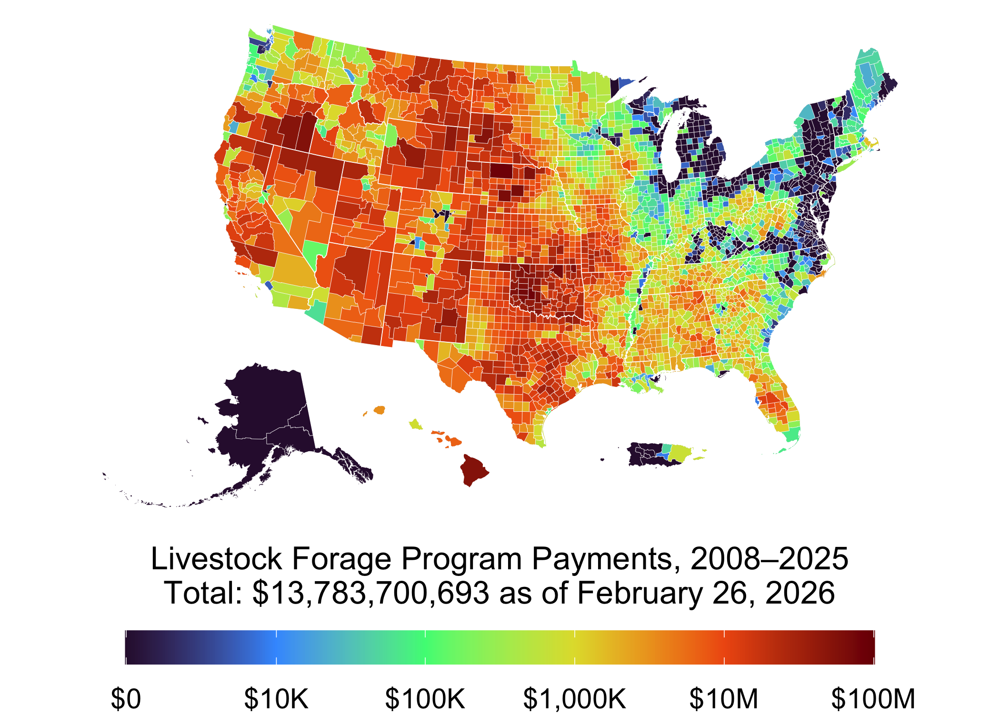

This repository provides a standardized archive of the US Department of
Agriculture Farm Service Agency (FSA) [Farm Payment
Files](https://www.fsa.usda.gov/tools/informational/freedom-information-act-foia/electronic-reading-room/frequently-requested/payment-files).
These files contain detailed records of payments made to agricultural
program participants, originally released as Microsoft Excel files.

The included R script automates the discovery, download, and conversion
of these files into a partitioned, analysis-ready format.

------------------------------------------------------------------------

## 📁 Repository Contents

- `fsa-payment-files.R`: Main R script to download, extract, clean, and
  write the payment files to a partitioned Parquet format.
- `README.Rmd`: This file. Contains background information, usage
  instructions, and archive structure.
- `data-raw/`: Folder used for downloading and unpacking Excel and CSV
  files.
- `fsa-payment-files/`: Final output directory containing the processed
  data as a Parquet dataset, partitioned by state and year.

------------------------------------------------------------------------

## 🔁 Processing Workflow

The `fsa-payment-files.R` script performs the following steps:

1.  **Discovery**: Scrapes the FSA payment files website to find
    downloadable Excel files (2004–2024).
2.  **Download**: Saves original files to `data-raw/`.
3.  **Extraction**: Parses each Excel file, handling annual variation in
    schema and formatting.
4.  **Standardization**: Renames fields, standardizes formats (e.g.,
    FIPS codes, program names), and removes duplicates.
5.  **Archiving**: Writes the full dataset to the `fsa-payment-files/`
    directory as partitioned Parquet files (`State FSA Name=` and
    `Accounting Program Year=` directories).
6.  **Upload** *(optional)*: Uses the AWS `paws` package to upload the
    full Parquet archive to a public S3 bucket for remote access.

------------------------------------------------------------------------

## ☁️ Public Access via S3

The full archive is hosted in a public Amazon S3 bucket:

    s3://sustainable-fsa/fsa-payment-files/

You can access the data directly using:

### AWS CLI

``` bash
aws s3 ls s3://sustainable-fsa/fsa-payment-files/ --no-sign-request
```

### In R with `arrow` and `s3://` support

``` r
library(arrow)
dataset <- 
  open_dataset("s3://sustainable-fsa/fsa-payment-files/", 
               filesystem = s3_bucket("sustainable-fsa", anonymous = TRUE))
```

------------------------------------------------------------------------

## 🧭 Notes

- File structure varies by year, and the script includes heuristics to
  detect column shifts and missing headers.
- Partitioning by state and year facilitates fast querying and
  cloud-native workflows.
- The processing script can be rerun to include new years as they are
  released.

------------------------------------------------------------------------

## 📅 Update Schedule

This dataset is refreshed annually after the USDA FSA releases new
payment files, typically in the spring. Additional years or corrections
may be processed as available.

------------------------------------------------------------------------

## 🔗 Related Resources

- [USDA FSA FOIA Payment
  Page](https://www.fsa.usda.gov/news-room/efoia/electronic-reading-room/frequently-requested-information/payment-files-information/index)
- [Arrow and Parquet in R](https://arrow.apache.org/docs/r/)

------------------------------------------------------------------------

## 📍 Quick Start: Visualize data in the FSA Farm Payment Files in R

This snippet shows how to load data from the Farm Payment Files archive
and create a simple map using `sf` and `ggplot2`.

``` r
# Load required libraries
library(arrow)
library(sf)
library(ggplot2) # For plotting
library(tigris)  # For state boundaries
library(rmapshaper) # For innerlines function

# Example accessing payment files on S3
# A map of 2024 LFP Payments by county

lfp_payments <-
  # arrow::s3_bucket("sustainable-fsa/fsa-payment-files",
  #                  anonymous = TRUE) %>%
  "fsa-payment-files" |>
  arrow::open_dataset() |>
  dplyr::filter(`Accounting Program Description` %in% 
                  c(
                    "LIVESTOCK FORAGE PROGRAM",
                    "LIVESTOCK FORAGE DISASTER PROGRAM",
                    "LIVESTOCK FORAGE DISASTER PROGRAM (COF)"
                  )) |>
  dplyr::group_by(`FSA Code`) |>
  dplyr::summarise(
    `Disbursement Amount` = sum(`Disbursement Amount`, na.rm = TRUE)
  ) |>
  dplyr::collect()

## Download from the FSA_Counties_dd17 archive
counties <- 
  sf::read_sf("https://sustainable-fsa.com/fsa-counties-dd17/fsa-counties-dd17.topojson",
              layer = "counties") |>
  sf::st_set_crs("EPSG:4326") |>
  sf::st_transform("EPSG:5070")

lfp_payments_counties <-
  lfp_payments |>
  dplyr::select(id = `FSA Code`,
                `Disbursement Amount`) |>
  dplyr::right_join(counties) |>
  sf::st_as_sf() |>
  dplyr::mutate(
    `Disbursement Amount` = 
      tidyr::replace_na(`Disbursement Amount`, 0)
  )


# Plot the map
ggplot(counties) +
  geom_sf(data = sf::st_union(counties),
          fill = "grey80",
          color = NA) +
  geom_sf(data = lfp_payments_counties,
          aes(fill = `Disbursement Amount`), 
          color = NA) +
  geom_sf(data = rmapshaper::ms_innerlines(counties),
          fill = NA,
          color = "white",
          linewidth = 0.1) +
  geom_sf(data = counties |>
            dplyr::group_by(state) |>
            dplyr::summarise() |>
            rmapshaper::ms_innerlines(),
          fill = NA,
          color = "white",
          linewidth = 0.2) +
  scale_fill_viridis_c(#palette = "OrRd",
    option = "turbo",
    direction = 1,
    na.value = "grey80",
    limits = c(0,100000000),
    breaks = c(0,10000,100000,1000000,10000000, 100000000),
    trans = scales::pseudo_log_trans(sigma = 1000),
    labels=scales::label_currency(scale_cut = scales::cut_short_scale()),
    name = 
      paste0(
        "Livestock Forage Program Payments, 2008–2025\nTotal: ",  
        scales:::dollar(sum(lfp_payments_counties$`Disbursement Amount`, na.rm = TRUE)),
        " as of ", format(lubridate::today(), "%B %d, %Y")
      ),
    guide = guide_colorbar(title.position = "top") ) +
  theme_void(base_size = 24) +
  theme(legend.position = "bottom",
        legend.justification = "center",
        legend.key.width = unit(0.15, "npc"),
        legend.title = element_text(size = 16, hjust = 0.5),
        legend.text = element_text(size = 14, hjust = 0.5),
        strip.text.x = element_text(margin = margin(b = 5)),
        strip.text.y = element_text(margin = margin(r = 5)))
```



------------------------------------------------------------------------

## 🧭 About FSA County Codes

The USDA FSA uses custom county definitions that differ from standard
ANSI/FIPS codes used by the U.S. Census. To align the Farm Payment Files
with geographic boundaries, use the FSA-specific geospatial dataset
archived in the companion repository:

🔗
[**sustainable-fsa/fsa-counties-dd17**](https://sustainable-fsa.com/fsa-counties-dd17/)

FSA county codes are documented in [FSA Handbook 1-CM, Exhibit
101](https://www.fsa.usda.gov/Internet/FSA_File/1-cm_r03_a80.pdf).

------------------------------------------------------------------------

## 📜 Citation

If using this data in published work, please cite:

> USDA Farm Service Agency. *Farm Payment Files, 2004–2025*. Archived by
> R. Kyle Bocinsky. Accessed via GitHub archive, YYYY.
> <https://sustainable-fsa.com/fsa-payment-files/>

------------------------------------------------------------------------

## 📄 License

- **Raw FSA Farm Payment Files data** (USDA): Public Domain (17 USC §
  105)
- **Processed data & scripts**: © R. Kyle Bocinsky, released under
  [CC0](https://creativecommons.org/publicdomain/zero/1.0/) and [MIT
  License](./LICENSE) as applicable

------------------------------------------------------------------------

## ⚠️ Disclaimer

This dataset is archived for research and educational use only. It may
not reflect current FSA payments and policy. Always consult your **local
FSA office** for the latest program guidance.

To locate your nearest USDA Farm Service Agency office, use the USDA
Service Center Locator:

🔗 [**USDA Service Center
Locator**](https://offices.sc.egov.usda.gov/locator/app)

------------------------------------------------------------------------

## 👏 Acknowledgment

This project is part of:

**[*Enhancing Sustainable Disaster Relief in FSA
Programs*](https://www.ars.usda.gov/research/project/?accnNo=444612)**\
Supported by USDA OCE/OEEP and USDA Climate Hubs\
Prepared by the [Montana Climate Office](https://climate.umt.edu)

------------------------------------------------------------------------

## 📬 Contact

**R. Kyle Bocinsky**\
Director of Climate Extension\
Montana Climate Office\
📧 <kyle.bocinsky@umontana.edu>\
🌐 <https://climate.umt.edu>
